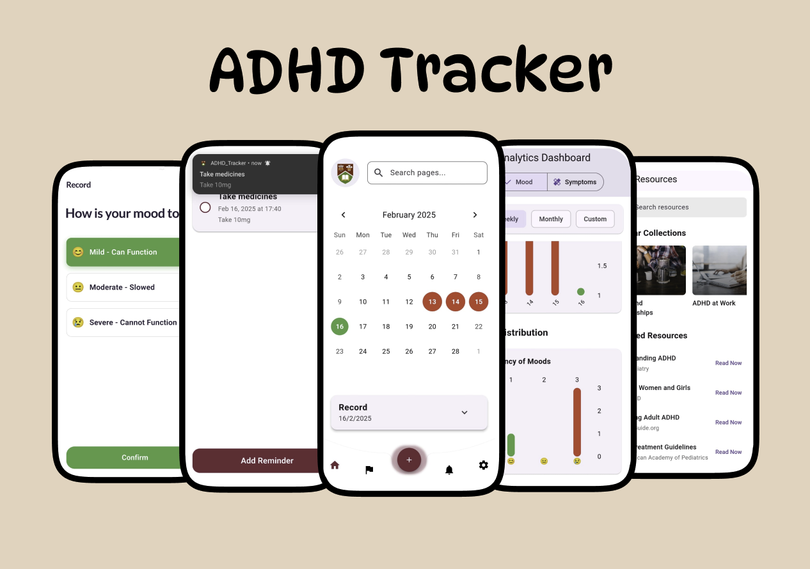

<p align="center">
  
</p>

# ADHD Tracker App

[Demo Link](https://drive.google.com/file/d/138Z2dB1OJSvv7c9HbgPqr9O3FJEXew9o/view?usp=drive_link)

A comprehensive ADHD Tracker designed to help users manage their daily routines effectively. This app offers mood, symptom, and medication tracking, along with useful resources, reminders, and insightful graph analytics.

---

## 🚀 **Features**

- 📊 **Mood Tracker:** Log daily moods for better emotional awareness.
- ✅ **Symptom Tracker:** Track symptoms to monitor patterns over time.
- 💊 **Medication Tracker:** Manage medication schedules and adherence.
- 📚 **Resource Web View:** Access ADHD-related resources within the app.
- 🔔 **Daily Reminders:** Set custom notifications for medications and tasks.
- 📈 **Graph Analysis:** Visualize trends and track overall progress.
- 📬 **FCM Notifications:** Receive timely alerts and important reminders.

---

## 🛠️ **Tech Stack**

- **Flutter** - Cross-platform mobile development
- **Node.js** - Backend API development
- **Firebase Cloud Messaging (FCM)** - Push notifications
- **Firebase Firestore** - Real-time database
- **Provider/BLoC** - State management
- **Chart Library** - Data visualization
- **Dart** - Programming language

---

## 🔗 **APIs & Tools Used**

- 📡 **Firebase Authentication** - Secure user login and registration
- 🔥 **Firestore Database** - Store and manage user data
- 📬 **Firebase Cloud Messaging (FCM)** - Push notifications
- 📊 **Charting Library** - Visual representation of tracked data
- 🌐 **Node.js REST API** - Backend API for data management

---

## 📱 **Demo**

Check out the live demo of the app: [ADHD Tracker Demo](https://drive.google.com/file/d/138Z2dB1OJSvv7c9HbgPqr9O3FJEXew9o/view?usp=drive_link)

---

## 📄 **How to Run Locally**

1. **Clone the repository:**
   ```bash
   git clone https://github.com/yourusername/adhd-tracker-app.git
   ```
2. **Navigate to the project folder:**
   ```bash
   cd adhd-tracker-app
   ```
3. **Install dependencies:**
   ```bash
   flutter pub get
   ```
4. **Run the app:**
   ```bash
   flutter run
   ```

---

## 📝 **License**

This project is licensed under the [MIT License](LICENSE).

---

## 🙌 **Contributing**

Contributions, issues, and feature requests are welcome! Feel free to submit a [pull request](https://github.com/yourusername/adhd-tracker-app/pulls).

---

## 📧 **Contact**

For any queries or feedback, feel free to reach out at: [your-email@example.com](mailto:khushbalchandani1@gmail.com)

# adhd_tracker
# adhd_tracker
